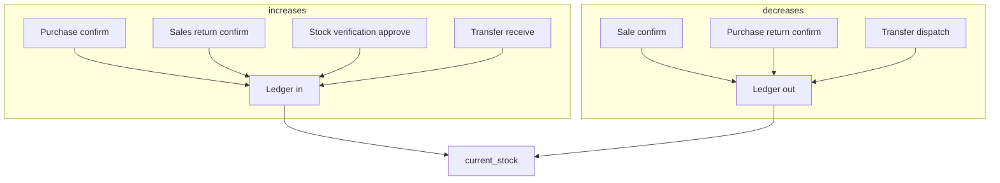

# Inventory Module — Automated Test Results

**Date:** 2026-08-25  
**Test file:** `PotAndLeaf-backend/tests/Feature/InventoryModuleTest.php`  
**Framework:** Pest 5 (Laravel API feature tests)  
**Command:** `php artisan test tests/Feature/InventoryModuleTest.php`  
**Production code modified:** No

---

## Summary

| Status | Count |
|--------|-------|
| **Passed** | **16** |
| **Failed** | **0** |
| **Skipped** | **0** |
| **Errors** | **0** |
| **Total** | **16** |

**Assertions:** 98  
**Duration:** ~2.8s

---

## Inventory workflow (inspected)

Stock changes flow through `InventoryService::post()` — every movement appends a ledger row and updates `Product.current_stock`. Negative balances are blocked on outbound posts.



| API | Purpose |
|-----|---------|
| `GET /api/inventory/stock` | Stock levels list (search, low_only filter) |
| `GET /api/inventory/ledger` | Movement history per product |
| `GET /api/inventory/valuation` | Stock × cost valuation |
| `GET /api/inventory/alerts` | Reorder alerts |
| `POST /api/purchases/{id}/confirm` | Stock in (purchase) |
| `POST /api/sales/{id}/confirm` | Stock out (sale) |
| `POST /api/sales-returns/{id}/confirm` | Stock in (return) |
| `POST /api/purchase-returns/{id}/confirm` | Stock out (return) |
| `POST /api/transfers` + dispatch/receive | Inter-company stock move |
| `POST /api/stock-verifications` + submit/approve | Physical count adjustment |

**UI:** `PotAndLeaf-frontend/src/pages/inventory/InventoryList.jsx` — tabs: Stock levels, Ledger, Valuation, Fast/slow/dead.

---

## Integration approach

All stock movement tests use **real API calls** and verify **`current_stock` in the database** plus ledger entries where applicable. No business calculation mocks (except INVENTORY-016 server-error stub on `InventoryController::stock` only).

---

## Results by test case

### Passed (16)

| ID | Test case | Layer | Verification |
|----|-----------|-------|--------------|
| **INVENTORY-001** | Inventory page loads | API | `GET /api/inventory/stock` → 200 with pagination meta (powers list UI) |
| **INVENTORY-002** | Product appears in inventory | API | Product with stock 25 listed by id |
| **INVENTORY-003** | Search inventory | API | `search=Rose`, by SKU, no-match |
| **INVENTORY-004** | Filter inventory | API | `low_only=1` returns only low-stock item |
| **INVENTORY-005** | View stock quantity | API | `current_stock` 42.5 in stock response |
| **INVENTORY-006** | View inventory details | API | Ledger shows purchase `in`; valuation row stock × cost |
| **INVENTORY-007** | Purchase increases inventory | API | Confirm purchase → stock 0→15, ledger `purchase` |
| **INVENTORY-008** | Sale decreases inventory | API | Confirm sale qty 7 → stock 20→13, ledger `sale` out |
| **INVENTORY-009** | Sales return increases inventory | API | Return 2 units → stock 15→17, ledger `sales-return` in |
| **INVENTORY-010** | Purchase return decreases inventory | API | Return 5 units → stock 20→15, ledger `purchase-return` out |
| **INVENTORY-011** | Transfer decreases source | API | Inter-company dispatch → source 100→80 |
| **INVENTORY-012** | Transfer increases destination | API | Receive 12 units → dest stock 12, visible via dest company stock API |
| **INVENTORY-013** | Stock verification adjustment | API | Count 22 vs system 30 → stock 22, ledger `stock-verification` out 8 |
| **INVENTORY-014** | Zero stock | API | Product with 0 stock listed with `current_stock: 0` |
| **INVENTORY-015** | Negative stock blocked | API | Oversell confirm → 422; stock unchanged; no sale ledger row |
| **INVENTORY-016** | API error handling | API | Missing SKU → 422; invalid ledger direction → 422; mocked 500 |

---

### Skipped (0)

None — INVENTORY-001 covered via the stock list API that backs the inventory page.

---

### Failed (0)

No failures.

---

## Stock movement verification summary

| Scenario | Before | After | Ledger type |
|----------|--------|-------|-------------|
| Purchase confirm +15 | 0 | 15 | `purchase` in |
| Sale confirm −7 | 20 | 13 | `sale` out |
| Sales return +2 | 15 | 17 | `sales-return` in |
| Purchase return −5 | 20 | 15 | `purchase-return` out |
| Transfer dispatch −20 | 100 | 80 | (transfer workflow) |
| Transfer receive +20 (dest) | 0 | 20 | dest product stock |
| Stock verification −8 | 30 | 22 | `stock-verification` out |
| Oversell blocked | 5 | 5 | none |

No calculation mismatches observed — all balances verified against DB `current_stock`.

---

## Observations (informational)

1. **INVENTORY-001 (UI):** Frontend `InventoryList` uses React Query against `/inventory/stock`; API test confirms backend contract for the page.
2. **INVENTORY-011/012:** Inter-company transfers use full API (`POST /transfers`, dispatch, receive). Destination company access is granted only before receive to preserve source-company RBAC pivot integrity.
3. **INVENTORY-015:** `InventoryService::post()` and `ConfirmSale` both guard against negative stock — oversell returns 422 on confirm.
4. **INVENTORY-013:** Stock verification requires draft → submit → approve before ledger adjustment posts.
5. **INVENTORY-016:** Server 500 tested via test-only controller binding, not a live fault.

---

## How to re-run

```bash
cd PotAndLeaf-backend
php artisan test tests/Feature/InventoryModuleTest.php
php artisan test --group=inventory
```

Filter by case ID:

```bash
php artisan test --group=INVENTORY-007
```

---

## Traceability

| Artifact | Location |
|----------|----------|
| Test plan cases | `QA/TEST_PLAN.md` |
| Feature inventory | `QA/FEATURE_INVENTORY.md` |
| Test implementation | `PotAndLeaf-backend/tests/Feature/InventoryModuleTest.php` |
| Inventory service | `app/Services/InventoryService.php` |
| Related tests | `TransferPhase3Test.php`, `PurchaseModuleTest.php`, `SalesPhaseATest.php` |
