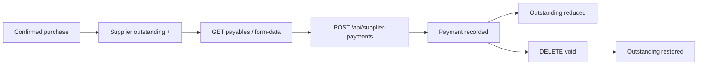

# Supplier Payment Module — Automated Test Results

**Date:** 2026-08-25  
**Test file:** `PotAndLeaf-backend/tests/Feature/PaymentModuleTest.php`  
**Framework:** Pest 5 (Laravel API feature tests)  
**Command:** `php artisan test tests/Feature/PaymentModuleTest.php`  
**Production code modified:** No

---

## Summary

| Status | Count |
|--------|-------|
| **Passed** | **12** |
| **Failed** | **0** |
| **Skipped** | **1** |
| **Errors** | **0** |
| **Total** | **13** |

**Assertions:** 101  
**Duration:** ~2.7s

---

## Payment workflow (inspected)



| Step | Endpoint | Result |
|------|----------|--------|
| List | `GET /api/supplier-payments` | Paginated history; filter by `supplier_id` |
| Form data | `GET /api/supplier-payments/form-data` | Suppliers with outstanding balances |
| Payables | `GET /api/supplier-payments/payables` | Confirmed GRNs with paid / balance / status |
| Record | `POST /api/supplier-payments` | Payment saved; supplier outstanding −= amount |
| Void | `DELETE /api/supplier-payments/{id}` | Soft-deleted; outstanding restored |

**Validation:** `StoreSupplierPaymentRequest`

- Required: `supplier_id`, `payment_date`, `amount` (**gt:0**), `mode` (**in:** cash, bank, upi, cheque)
- Optional: `purchase_id`, `reference`, `notes`

**Permissions:** `payments.view`, `payments.create`, `payments.delete`

**Note:** There is **no edit endpoint** (`PUT /api/supplier-payments/{id}`). Payments are record-only; void and re-record if correction is needed.

---

## Implementation inspected

| Layer | File | Notes |
|-------|------|-------|
| List UI | `PaymentsList.jsx` | Payables tab + payment history; record modal |
| API | `SupplierPaymentController.php` | index, formData, payables, store, destroy |
| Service | `PaymentService.php` | Outstanding sync; purchase `amount_paid` when linked |
| Model | `SupplierPayment.php` | Soft deletes; UUID primary key |
| Resource | `SupplierPaymentResource.php` | Flat JSON with supplier_name, purchase_no |

---

## Results by test case

### Passed (12)

| ID | Test case | Layer | Verification |
|----|-----------|-------|--------------|
| **PAYMENT-001** | Payment list | API | `GET /api/supplier-payments` → 200, 2 records |
| **PAYMENT-002** | Search payment | API | Filter by `supplier_id` returns matching row only |
| **PAYMENT-003** | Create valid payment | API | 201; linked to GRN; outstanding −600; payable status `partial` |
| **PAYMENT-004** | Empty payment form | API | Empty body → 422 (`supplier_id`, `payment_date`, `amount`, `mode`) |
| **PAYMENT-005** | Zero payment | API | `amount: 0` → 422 |
| **PAYMENT-006** | Negative payment | API | `amount: -100` → 422 |
| **PAYMENT-007** | Payment > outstanding | API | **Accepted** — outstanding 1000 → −500; no server-side cap (see finding below) |
| **PAYMENT-008** | Valid payment method | API | cash, bank, upi, cheque each → 201 |
| **PAYMENT-009** | Invalid payment method | API | card, credit → 422 (`mode`) |
| **PAYMENT-011** | Delete payment | API | `DELETE` voids payment; outstanding restored 600 → 1000 |
| **PAYMENT-012** | API validation error | API | Invalid supplier/date/amount/mode → 422 with `errors` object |
| **PAYMENT-013** | API server error | API | Simulated 500 on create (test-only mock) |

### Skipped (1)

| ID | Test case | Reason |
|----|-----------|--------|
| **PAYMENT-010** | Edit payment | Not supported — no `PUT /api/supplier-payments/{id}` in API |

---

## Payment scenarios verified

### PAYMENT-003 — Valid payment against GRN

| Field | Value |
|-------|-------|
| Purchase total | ₹1,000 (10 × ₹100) |
| Payment amount | ₹600 (UPI) |
| Outstanding after | ₹400 |
| Payable status | `partial` |
| Paid on GRN | ₹600 |
| Balance on GRN | ₹400 |

### PAYMENT-007 — Overpayment (actual behavior)

| Stage | Supplier outstanding |
|-------|---------------------|
| After purchase confirm (₹1,000) | ₹1,000 |
| After payment ₹1,500 | **−₹500** |

**Finding:** The API does **not** reject payments exceeding supplier outstanding or GRN balance. Overpayment is recorded and outstanding can go negative. Frontend modal shows outstanding but does not block submit client-side either.

---

## Valid payment modes

| Mode | Accepted |
|------|----------|
| cash | ✅ |
| bank | ✅ |
| upi | ✅ |
| cheque | ✅ |
| card | ❌ 422 |
| credit | ❌ 422 |

---

## Test setup notes

- Uses `RefreshDatabase` + `CreatesErpFixtures`
- Confirmed purchases created via API to populate supplier outstanding before payment tests
- Permissions: `payments.view`, `payments.create`, `payments.delete`, plus `purchases.create` / `purchases.confirm` for fixtures
- “Search” maps to API `supplier_id` filter (no free-text search on payment list)

---

## How to re-run

```bash
cd PotAndLeaf-backend
php artisan test tests/Feature/PaymentModuleTest.php
```

Filter by case ID:

```bash
php artisan test tests/Feature/PaymentModuleTest.php --group=PAYMENT-003
php artisan test tests/Feature/PaymentModuleTest.php --group=PAYMENT-007
```
