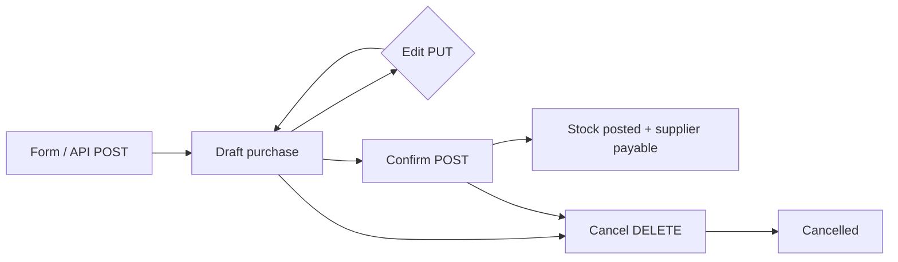

# Purchase Module — Automated Test Results

**Date:** 2026-08-25  
**Test file:** `PotAndLeaf-backend/tests/Feature/PurchaseModuleTest.php`  
**Framework:** Pest 5 (Laravel API feature tests)  
**Command:** `php artisan test tests/Feature/PurchaseModuleTest.php`  
**Production code modified:** No

---

## Summary

| Status | Count |
|--------|-------|
| **Passed** | **20** |
| **Failed** | **0** |
| **Skipped** | **1** |
| **Errors** | **0** |
| **Total** | **21** |

**Assertions:** 97  
**Duration:** ~2.5s

---

## Purchase workflow (inspected)



| Step | Endpoint | Result |
|------|----------|--------|
| Create | `POST /api/purchases` | Draft saved; totals computed server-side |
| Form data | `GET /api/purchases/form-data` | Active suppliers + products |
| Edit | `PUT /api/purchases/{id}` | Draft only; lines replaced; totals recalculated |
| Confirm | `POST /api/purchases/{id}/confirm` | Status `confirmed`; stock in; supplier `outstanding` += `grand_total` |
| Cancel | `DELETE /api/purchases/{id}` | Status `cancelled`; draft has no stock reversal |

**Calculation engine:** `PurchaseCalculator.php` (mirrored by `PotAndLeaf-frontend/src/lib/purchaseCalc.js`)

- Line taxable value = `qty × rate − discount`
- Intra-state GST → CGST + SGST (half each)
- Inter-state GST → IGST (full rate)
- Landed cost allocated proportionally by taxable value; last line gets rounding remainder
- Grand total = subtotal + tax_total + landed_cost_total

---

## Implementation inspected

| Layer | File | Notes |
|-------|------|-------|
| List UI | `PurchasesList.jsx` | Status tabs, confirm from list, navigate to `/purchases/new` |
| Form UI | `PurchaseForm.jsx` | Supplier pick, add/remove lines, client `computePurchase()` preview, save draft |
| API | `PurchaseController.php` | CRUD + confirm + form-data |
| Validation | `StorePurchaseRequest.php` | Required: `supplier_id`, `purchase_date`, `items` (min 1); `qty` must be `gt:0` |
| Actions | `CreatePurchase`, `UpdatePurchase`, `ConfirmPurchase`, `CancelPurchase` | Draft → confirm posts batches + inventory |
| Calculator | `PurchaseCalculator.php` | Single source of truth for totals |

---

## Missing frontend dependencies (not installed)

UI case **PURCHASE-001** requires:

```bash
cd PotAndLeaf-frontend
npm install -D vitest jsdom @testing-library/react @testing-library/jest-dom @testing-library/user-event
```

Optional for full browser E2E: `@playwright/test`

---

## Results by test case

### Passed (20)

| ID | Test case | Layer | Verification |
|----|-----------|-------|--------------|
| **PURCHASE-002** | Create purchase | API | `POST` → 201 draft, purchase_no assigned |
| **PURCHASE-003** | Select supplier | API | Missing/invalid supplier → 422; valid supplier stored on create |
| **PURCHASE-004** | Add product | API | Single line persisted with product_id and qty |
| **PURCHASE-005** | Add multiple products | API | Two lines persisted |
| **PURCHASE-006** | Remove product | API | `PUT` with one line removes second item |
| **PURCHASE-007** | Valid quantity | API | Decimal qty 12.5 accepted |
| **PURCHASE-008** | Zero quantity | API | `qty: 0` → 422 |
| **PURCHASE-009** | Negative quantity | API | `qty: -5` → 422 |
| **PURCHASE-010** | Change quantity | API | Qty 10→20 doubles subtotal (recalculated) |
| **PURCHASE-011** | Verify subtotal | API | Two lines → subtotal **1250.00** (matches calculator) |
| **PURCHASE-012** | Verify discount | API | discount_total **75.00**, taxable **925.00** |
| **PURCHASE-013** | Verify tax | API | Intra: CGST/SGST 90+90; Inter: IGST 180 |
| **PURCHASE-014** | Verify grand total | API | Multi-line + landed 100 → **1582.40** |
| **PURCHASE-015** | Submit valid purchase | API | Full header + items → draft with correct grand_total |
| **PURCHASE-016** | Incomplete purchase | API | Empty body / empty items → 422 |
| **PURCHASE-017** | Edit purchase | API | `PUT` updates invoice, notes, recalculated subtotal |
| **PURCHASE-018** | Cancel purchase | API | `DELETE` draft → status `cancelled` |
| **PURCHASE-019** | Confirm purchase | API | Stock +10, supplier outstanding += grand_total, status `confirmed` |
| **PURCHASE-020** | API validation error | API | Invalid date → 422 with `errors` object |
| **PURCHASE-021** | API server error | API | Simulated 500 on create (test-only mock) |

---

### Skipped (1)

| ID | Test case | Reason | Install to enable |
|----|-----------|--------|-------------------|
| **PURCHASE-001** | Open purchase page | UI: navigates to `/purchases/new` | vitest + RTL |

---

### Failed (0)

No failures.

---

## Calculation verification (no errors found)

All monetary assertions were checked against `PurchaseCalculator` — the same class used by `CreatePurchase` and `UpdatePurchase`.

| Scenario | Expected | API result |
|----------|----------|------------|
| Subtotal (10×100 + 5×50) | 1250.00 | ✓ |
| Discount line (10×100 − 75) | discount 75, taxable 925 | ✓ |
| Intra GST 18% on 1000 | tax 180, CGST 90, SGST 90 | ✓ |
| Inter GST 18% on 1000 | IGST 180, CGST/SGST 0 | ✓ |
| Grand total (1270 + 212.40 tax + 100 landed) | **1582.40** | ✓ |
| Qty change 10→20 @ rate 100 | subtotal 2000 | ✓ |

**Landed cost allocation:** Last line receives rounding remainder so allocations sum exactly to `landed_cost_total` (verified implicitly via grand_total match on PURCHASE-014).

---

## Failure analysis

None — all executable API tests passed. No calculation mismatches detected between persisted totals and `PurchaseCalculator`.

---

## Observations (informational)

1. **Draft-first workflow:** Purchases are saved as `draft` on create; stock is not posted until confirm (PURCHASE-019).
2. **PURCHASE-006 (UI):** Frontend `removeLine()` keeps at least one row; API update with fewer items is the authoritative remove test.
3. **PURCHASE-008/009:** Backend uses `gt:0` on qty; frontend also blocks qty ≤ 0 in `validateForm()`.
4. **PURCHASE-018:** Cancelling a draft does not reverse stock (none was posted).
5. **PURCHASE-019:** Confirm increases product `current_stock` and supplier `outstanding` by `grand_total`.
6. **PURCHASE-021:** 500 tested via test-only controller binding, not a live fault.

---

## How to re-run

```bash
cd PotAndLeaf-backend
php artisan test tests/Feature/PurchaseModuleTest.php
php artisan test --group=purchase
```

Filter by case ID:

```bash
php artisan test --group=PURCHASE-014
```

---

## Traceability

| Artifact | Location |
|----------|----------|
| Test plan cases | `QA/TEST_PLAN.md` |
| Feature inventory | `QA/FEATURE_INVENTORY.md` |
| Test implementation | `PotAndLeaf-backend/tests/Feature/PurchaseModuleTest.php` |
| Related existing tests | `PotAndLeaf-backend/tests/Feature/PurchaseUpdateTest.php` |
| Calculator | `app/Support/Purchasing/PurchaseCalculator.php` |
