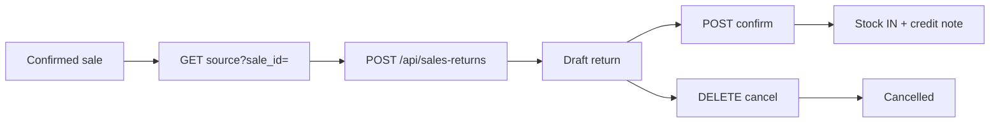
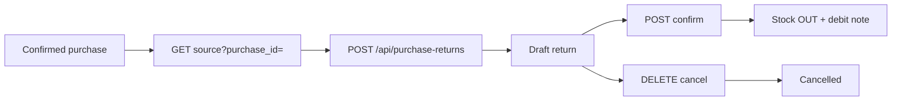

# Sales Return & Purchase Return — Automated Test Results

**Date:** 2026-08-25  
**Test file:** `PotAndLeaf-backend/tests/Feature/ReturnModuleTest.php`  
**Framework:** Pest 5 (Laravel API feature tests)  
**Command:** `php artisan test tests/Feature/ReturnModuleTest.php`  
**Production code modified:** No

---

## Summary

| Status | Count |
|--------|-------|
| **Passed** | **19** |
| **Failed** | **0** |
| **Skipped** | **0** |
| **Errors** | **0** |
| **Total** | **19** |

**Assertions:** 132  
**Duration:** ~11s

| Module | Cases | Passed |
|--------|-------|--------|
| Sales Return | SRETURN-001 … SRETURN-011 | 11 |
| Purchase Return | PRETURN-001 … PRETURN-008 | 8 |

---

## Sales Return workflow (inspected)



| Step | Endpoint | Result |
|------|----------|--------|
| Source | `GET /api/sales-returns/source?sale_id=` | Confirmed sale only; per-line `returnable` qty |
| Create | `POST /api/sales-returns` | Draft; rates/GST from original sale lines |
| Confirm | `POST /api/sales-returns/{id}/confirm` | Status `confirmed`; stock restored (`sales-return` ledger) |
| Cancel | `DELETE /api/sales-returns/{id}` | Draft → `cancelled`; confirmed → reverses stock |

**Validation:** `StoreSalesReturnRequest` — `sale_id`, `return_date`, `items.*.sale_item_id`, `items.*.qty` **gt:0**  
**Business rules:** `CreateSalesReturn` caps qty at still-returnable; `ConfirmSalesReturn` re-checks before posting  
**Calculator:** `SaleCalculator.php` (pro-rated line discount by return qty share)

**Permissions:** `sales_returns.view`, `sales_returns.create`, `sales_returns.confirm`, `sales_returns.delete`

---

## Purchase Return workflow (inspected)



| Step | Endpoint | Result |
|------|----------|--------|
| Source | `GET /api/purchase-returns/source?purchase_id=` | Confirmed purchase; returnable qty + optional batches |
| Create | `POST /api/purchase-returns` | Draft; rates from original purchase lines |
| Confirm | `POST /api/purchase-returns/{id}/confirm` | Status `confirmed`; stock reduced (`purchase-return` ledger) |
| Cancel | `DELETE /api/purchase-returns/{id}` | Draft → `cancelled`; no stock change until confirm |

**Validation:** `StorePurchaseReturnRequest` — `purchase_id`, `return_date`, `items.*.purchase_item_id`, `items.*.qty` **gt:0**; optional `product_batch_id`  
**Business rules:** `CreatePurchaseReturn` caps qty; confirm checks stock on hand and batch remaining  
**Calculator:** `PurchaseCalculator.php`

**Permissions:** `purchase_returns.view`, `purchase_returns.create`, `purchase_returns.confirm`, `purchase_returns.delete`

---

## Results by test case

### Sales Return — Passed (11)

| ID | Test case | Layer | Verification |
|----|-----------|-------|--------------|
| **SRETURN-001** | Create return | API | `POST` → 201 draft, linked to confirmed sale |
| **SRETURN-002** | Select sale | API | Source 200 for confirmed sale; 404 for draft / unknown sale |
| **SRETURN-003** | Select product | API | Source returns `sale_item_id`, product; invalid item → 422 |
| **SRETURN-004** | Valid return quantity | API | Qty 4 accepted; grand_total ₹400 |
| **SRETURN-005** | Zero quantity | API | `qty: 0` → 422 (`items.0.qty`) |
| **SRETURN-006** | Negative quantity | API | `qty: -2` → 422 (`items.0.qty`) |
| **SRETURN-007** | Return more than sold | API | Qty 6 when sold 5 → 422 (`items`) |
| **SRETURN-008** | Submit return | API | Draft saved with reason/notes; stock unchanged until confirm |
| **SRETURN-009** | Confirm return | API | `POST confirm` → status `confirmed` |
| **SRETURN-010** | Cancel return | API | `DELETE` draft → status `cancelled`; stock unchanged |
| **SRETURN-011** | Verify inventory increases | API | Stock 12 → 15 after return 3; ledger direction `in` |

### Purchase Return — Passed (8)

| ID | Test case | Layer | Verification |
|----|-----------|-------|--------------|
| **PRETURN-001** | Create return | API | `POST` → 201 draft, linked to confirmed purchase |
| **PRETURN-002** | Select purchase | API | Source 200 for confirmed; 404 for draft / unknown |
| **PRETURN-003** | Select product | API | Source returns `purchase_item_id`, product; invalid item → 422 |
| **PRETURN-004** | Valid return quantity | API | Qty 5 accepted; grand_total ₹250 |
| **PRETURN-005** | Return > purchased | API | Qty 11 when purchased 10 → 422 (`items`) |
| **PRETURN-006** | Confirm return | API | `POST confirm` → status `confirmed` |
| **PRETURN-007** | Cancel return | API | `DELETE` draft → status `cancelled`; stock unchanged |
| **PRETURN-008** | Verify inventory decreases | API | Stock 20 → 13 after return 7; ledger direction `out` |

---

## Inventory impact (verified)

### Sales Return — SRETURN-011

| Stage | Stock | Change |
|-------|-------|--------|
| Opening | 20 | — |
| After sale confirm (qty 8) | 12 | −8 |
| After return confirm (qty 3) | **15** | **+3** |

Ledger: `reference_type=sales-return`, `direction=in`, `qty=3`

### Purchase Return — PRETURN-008

| Stage | Stock | Change |
|-------|-------|--------|
| After purchase confirm (qty 20) | 20 | +20 |
| After return confirm (qty 7) | **13** | **−7** |

Ledger: `reference_type=purchase-return`, `direction=out`, `qty=7`

---

## Calculation samples (verified)

| Case | Lines | Expected grand_total | Actual |
|------|-------|---------------------|--------|
| SRETURN-004 | 4 × ₹100 (0% GST) | ₹400 | ₹400 |
| PRETURN-004 | 5 × ₹50 (0% GST) | ₹250 | ₹250 |

---

## Implementation inspected

| Layer | File | Notes |
|-------|------|-------|
| Sales Return API | `SalesReturnController.php` | index, source, store, show, confirm, destroy |
| Purchase Return API | `PurchaseReturnController.php` | index, source, store, show, confirm, destroy |
| Create actions | `CreateSalesReturn.php`, `CreatePurchaseReturn.php` | Draft build; qty caps; server-side totals |
| Confirm actions | `ConfirmSalesReturn.php`, `ConfirmPurchaseReturn.php` | Stock post; customer/supplier side effects on sales side |
| Cancel actions | `CancelSalesReturn.php`, `CancelPurchaseReturn.php` | Draft cancel; confirmed reversal on delete |
| Resources | `SalesReturnResource.php`, `PurchaseReturnResource.php` | Nested `sale` / `purchase` objects (not flat `*_id` in JSON) |

---

## Test setup notes

- Each test uses `RefreshDatabase` + `CreatesErpFixtures`
- Source documents: confirmed sale/purchase created via API before return tests
- Permissions include sales/purchases create+confirm for fixture setup, plus return module permissions and `inventory.view` for ledger assertions
- Related coverage also exists in `InventoryModuleTest.php` (INVENTORY-009, INVENTORY-010)

---

## How to re-run

```bash
cd PotAndLeaf-backend
php artisan test tests/Feature/ReturnModuleTest.php
```

Filter by case ID:

```bash
php artisan test tests/Feature/ReturnModuleTest.php --group=SRETURN-007
php artisan test tests/Feature/ReturnModuleTest.php --group=PRETURN-005
```
