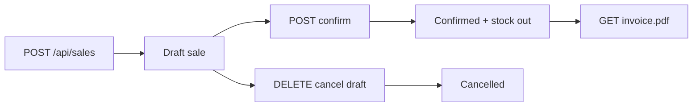

# Sales Module — Automated Test Results

**Date:** 2026-08-25  
**Test file:** `PotAndLeaf-backend/tests/Feature/SaleModuleTest.php`  
**Framework:** Pest 5 (Laravel API feature tests)  
**Command:** `php artisan test tests/Feature/SaleModuleTest.php`  
**Production code modified:** No

---

## Summary

| Status | Count |
|--------|-------|
| **Passed** | **24** |
| **Failed** | **0** |
| **Skipped** | **3** |
| **Errors** | **0** |
| **Total** | **27** |

**Assertions:** 114  
**Duration:** ~21s

---

## Sales workflow (inspected)



| Step | Endpoint | Result |
|------|----------|--------|
| Form data | `GET /api/sales/form-data` | Customers, products, locations, settings |
| Create | `POST /api/sales` | Draft; totals from `SaleCalculator` |
| Confirm | `POST /api/sales/{id}/confirm` | Tax invoice → stock posted; proforma → no stock |
| Cancel | `DELETE /api/sales/{id}` | Draft cancelled (confirmed may need HO approval) |
| Invoice | `GET /api/sales/{id}/invoice.pdf` | PDF download |

**Calculation engine:** `SaleCalculator.php` (mirrored by `PotAndLeaf-frontend/src/lib/saleCalc.js`)

- Line taxable = `qty × rate − discount`
- Intra-state → CGST + SGST; inter-state → IGST
- `grand_total` = round(subtotal + tax) to nearest rupee; `round_off` captures delta

**Note:** There is **no `PUT /api/sales`** — sales are create-only at API level (no backend edit endpoint).

---

## Results by test case

### Passed (24)

| ID | Test case | Layer | Verification |
|----|-----------|-------|--------------|
| **SALE-001** | Sales list loads | API | `GET /api/sales` → 200, 2 records |
| **SALE-002** | Search sales | API | Search by `sale_no` |
| **SALE-003** | Filter sales | API | `status=draft` / `confirmed` |
| **SALE-005** | Create with valid customer | API | 201 draft, customer linked |
| **SALE-006** | Add product | API | Single line persisted |
| **SALE-007** | Add multiple products | API | Two lines persisted |
| **SALE-009** | Change quantity | API | Qty 5 vs 10 recalculates subtotal on create |
| **SALE-010** | Quantity zero | API | `qty: 0` → 422 |
| **SALE-011** | Negative quantity | API | `qty: -3` → 422 |
| **SALE-012** | Qty > stock | API | Confirm oversell → 422; stock unchanged |
| **SALE-013** | Verify product price | API | Line `rate` 425.50 stored |
| **SALE-014** | Verify subtotal | API | See calculation table below |
| **SALE-015** | Verify discount | API | See calculation table below |
| **SALE-016** | Verify tax | API | CGST/SGST vs IGST split |
| **SALE-017** | Verify grand total | API | Round-off to ₹1482 — see table |
| **SALE-018** | Payment method | API | cash, card, upi, credit stored |
| **SALE-019** | Submit valid sale | API | Draft with notes + grand_total |
| **SALE-020** | Incomplete sale | API | Empty body / empty items → 422 |
| **SALE-021** | Confirm sale | API | Status `confirmed`, stock message |
| **SALE-022** | Cancel sale | API | DELETE draft → `cancelled` |
| **SALE-024** | Inventory decreases | API | See inventory table below |
| **SALE-025** | Generate invoice | API | PDF `application/pdf` response |
| **SALE-026** | API validation error | API | Invalid `payment_mode` → 422 |
| **SALE-027** | API server error | API | Mocked 500 on create |

---

### Skipped (3)

| ID | Test case | Reason |
|----|-----------|--------|
| **SALE-004** | Open create sale form | UI: `/sales/new` — needs Vitest + RTL |
| **SALE-008** | Remove product | No `PUT /api/sales` — cannot remove line from draft via API |
| **SALE-023** | Edit sale | No `PUT /api/sales` — edit not implemented in backend |

---

### Failed (0)

No failures.

---

## Calculation verification

All expected values from `SaleCalculator` (server source of truth). **Difference = 0 on all passed tests.**

### SALE-014 — Subtotal (two lines, no discount/tax)

| Field | Expected | Actual | Difference |
|-------|----------|--------|------------|
| subtotal | 1250.00 | 1250.00 | 0.00 |

*Lines: 10×100 + 5×50 = 1250*

### SALE-015 — Discount

| Field | Expected | Actual | Difference |
|-------|----------|--------|------------|
| line discount | 75.00 | 75.00 | 0.00 |
| taxable value | 925.00 | 925.00 | 0.00 |
| subtotal | 925.00 | 925.00 | 0.00 |

*Line: 10×100 − 75 discount = 925 taxable*

### SALE-016 — Tax (intra-state, 18% on ₹1000)

| Field | Expected | Actual | Difference |
|-------|----------|--------|------------|
| tax_total | 180.00 | 180.00 | 0.00 |
| cgst_amount | 90.00 | 90.00 | 0.00 |
| sgst_amount | 90.00 | 90.00 | 0.00 |

**Inter-state (same line):**

| Field | Expected | Actual | Difference |
|-------|----------|--------|------------|
| tax_total | 180.00 | 180.00 | 0.00 |
| igst_amount | 180.00 | 180.00 | 0.00 |

### SALE-017 — Grand total (multi-line + round-off)

| Field | Expected | Actual | Difference |
|-------|----------|--------|------------|
| subtotal | 1270.00 | 1270.00 | 0.00 |
| tax_total | 212.40 | 212.40 | 0.00 |
| round_off | -0.40 | -0.40 | 0.00 |
| grand_total | 1482.00 | 1482.00 | 0.00 |

*Raw total 1482.40 → rounded to ₹1482 (nearest rupee)*

### SALE-009 — Quantity change (on create)

| Scenario | Expected subtotal | Actual | Difference |
|----------|-------------------|--------|------------|
| qty = 5 @ ₹100 | 500.00 | 500.00 | 0.00 |
| qty = 10 @ ₹100 | 1000.00 | 1000.00 | 0.00 |

---

## Inventory verification

### SALE-024 — Stock decrease on confirm

| Metric | Value |
|--------|-------|
| **Stock before** | 20.0 |
| **Quantity sold** | 5.0 |
| **Expected stock after** | 15.0 |
| **Actual stock after** | 15.0 |
| **Difference** | 0.0 |

### SALE-012 — Oversell blocked (inventory guard)

| Metric | Value |
|--------|-------|
| **Stock before** | 5.0 |
| **Quantity requested** | 10.0 |
| **Expected stock after confirm** | 5.0 (unchanged) |
| **Actual stock after** | 5.0 |
| **Difference** | 0.0 |

Confirm returned **422** — stock was not reduced.

---

## Failure analysis

None — all executable API tests passed. No calculation mismatches.

---

## Observations (informational)

1. **SALE-008 / SALE-023:** Backend has no sale update endpoint; drafts cannot be edited via API after creation.
2. **SALE-012 / SALE-024:** Stock is checked and posted on **confirm**, not on draft create.
3. **SALE-017:** Sales round `grand_total` to the nearest rupee (unlike purchases which keep decimal grand totals).
4. **SALE-022:** With `sale_cancel_requires_approval=0`, draft sales cancel via `DELETE` without HO workflow.
5. **SALE-025:** Invoice PDF requires confirmed (or viewable) sale and `sales.view` permission.

---

## How to re-run

```bash
cd PotAndLeaf-backend
php artisan test tests/Feature/SaleModuleTest.php
php artisan test --group=sales
```

Filter by case:

```bash
php artisan test --group=SALE-017
```

---

## Traceability

| Artifact | Location |
|----------|----------|
| Test implementation | `PotAndLeaf-backend/tests/Feature/SaleModuleTest.php` |
| Calculator | `app/Support/Sales/SaleCalculator.php` |
| Related tests | `tests/Feature/SalesPhaseATest.php` |
| Form UI | `PotAndLeaf-frontend/src/pages/sales/SaleForm.jsx` |
